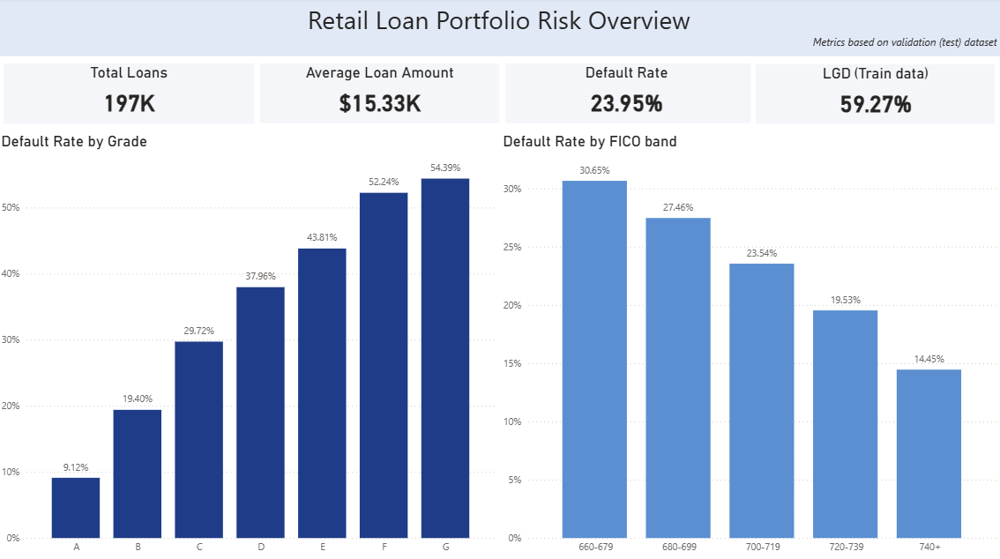
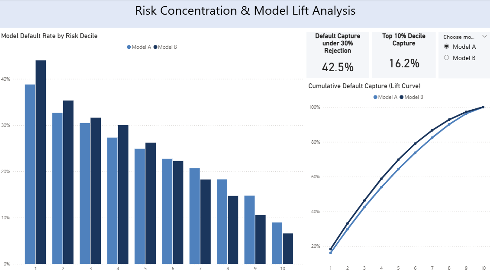
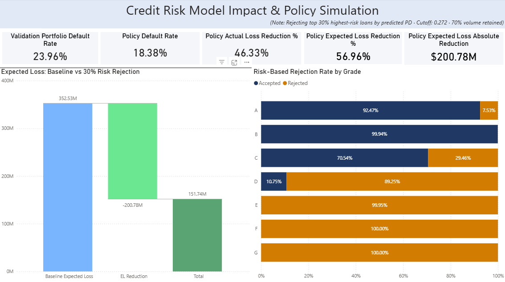

# Retail Credit Risk PD Model

## Business Objective

Retail lending portfolios are exposed to significant default risk.  
This project develops a **Probability of Default (PD)** model to:

- Rank borrower risk systematically  
- Compare alternative model specifications  
- Simulate underwriting policy decisions  
- Quantify economic impact using Expected Loss  

---

## Interactive Dashboard Preview

---

## Dataset

**Source:** LendingClub public dataset (Kaggle)

- Data restricted to 2016–2018 originations  
- Dataset not included due to size constraints  

### Temporal Split Strategy

2019 originations were excluded due to right-censoring:

- Many 2019 loans remained "Current"
- Only early defaults were resolved
- Including 2019 would bias PD upward

To avoid survivorship bias:

- **Training Set:** 2016–2017  
- **Validation Set:** 2018  

This ensures a clean out-of-time evaluation framework.    

---

## Modeling Approach

Two logistic regression models were developed:

### Model A — Borrower Risk Only
- WOE transformation  
- Excludes pricing variables  

### Model B — Borrower + Pricing
- Includes interest rate  
- Higher discrimination power, but introduces potential pricing circularity  

**Feature Engineering:**
- WOE encoding  
- IV-based variable selection  
- Logistic Regression (scikit-learn)  

---

## Model Performance (Validation Set)

| Metric | Model A | Model B |
|--------|---------|---------|
| AUC | 0.63 | 0.68 |
| KS | 0.19 | 0.26 |
| Top Decile Capture | 16.2% | 18.4% |
| 30% Reject Capture | 42.5% | 46.3% |

Model B demonstrates stronger risk concentration and separation.

---

## Policy Simulation

Underwriting strategy simulated:

> Reject top 30% highest predicted risk loans.

Expected Loss (EL) computed as:

EL = PD × LGD × Loan Amount 

LGD estimated from historical recoveries at 59.3%.

### Economic Impact

| Model | Baseline EL | Policy EL | EL Reduction |
|-------|-------------|-----------|--------------|
| Model A | 322M | 186M | 42% |
| Model B | 369M | 178M | 52% |

Model-driven rejection materially reduces portfolio expected loss.

---

## Key Insights

- Default risk shows clear gradient across FICO bands and Grade  
- Model B improves risk ranking performance  
- Top decile captures ~18% of defaults  
- 30% risk rejection removes nearly half of total bads  
- Economic impact under policy simulation is substantial  

---

## Future Improvements

- Incorporate survival modeling to handle censoring more rigorously  
- Add reject inference methodology  
- Compare with tree-based models (XGBoost)  
- Introduce capital requirement impact simulation  

---

## Tech Stack

- **Python** (pandas, scikit-learn)  
- **PostgreSQL** (decile analysis & policy simulation)  
- **Power BI** (interactive dashboard reporting)  

---

## Repository Structure
- sql/ -> Analytics & policy simulation queries
- notebooks/ -> Modeling pipeline
- reports/ -> Power BI dashboard
- data/ -> Dataset placeholder

---

This project demonstrates end-to-end credit risk analytics:

**Data Preparation → PD Modeling → SQL Validation → Economic Simulation → Business Reporting**
