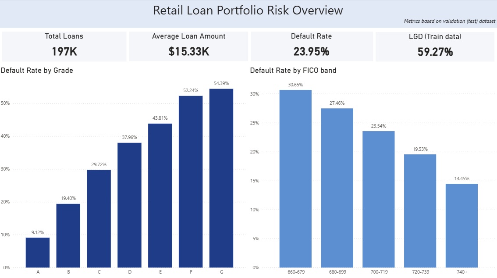
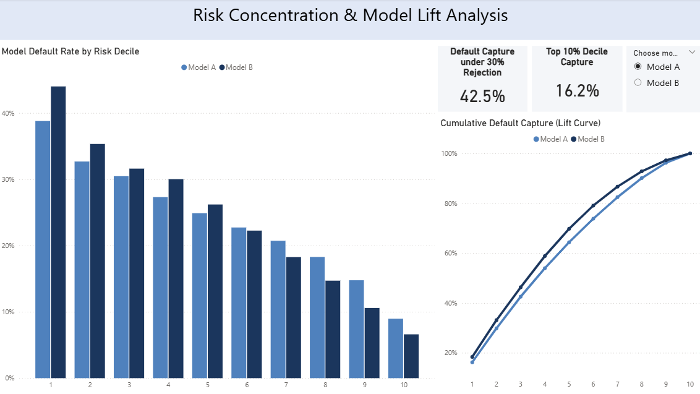
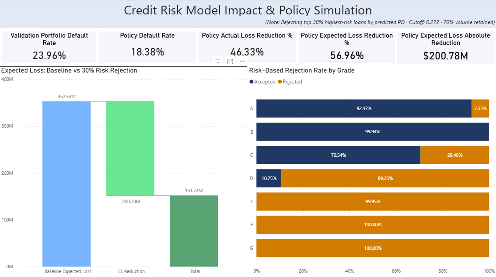
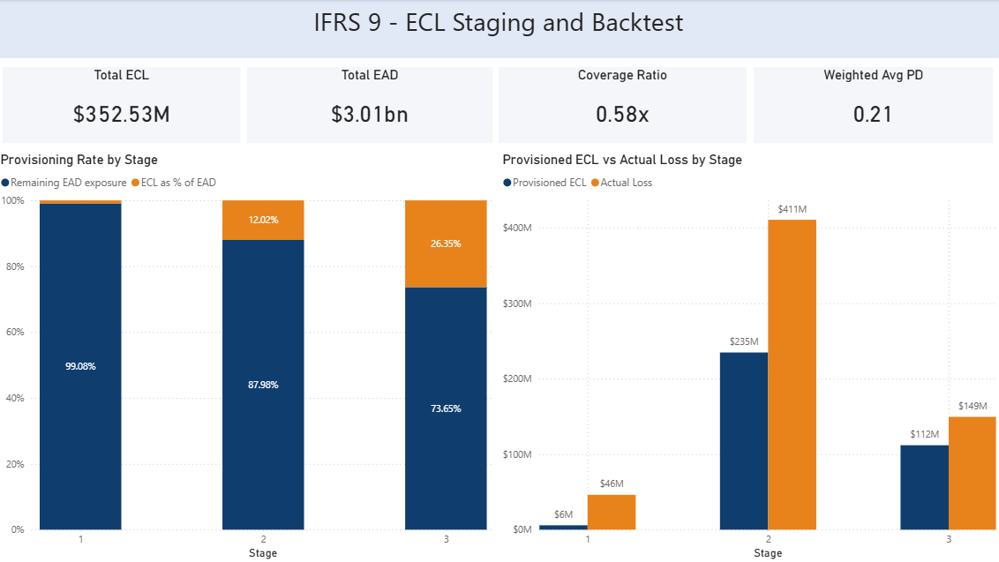
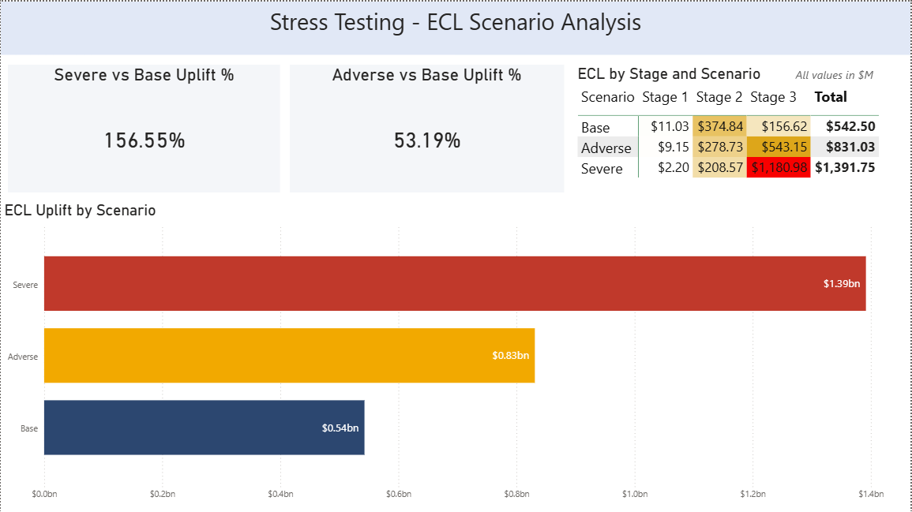

# Credit Default Prediction: ML Pipeline with Validation and Stress Testing

## Overview

End-to-end default prediction pipeline on 900k resolved loans. Logistic regression with WoE transformation, out-of-time validation on a fully resolved 2018 holdout cohort, and macro stress testing across three scenarios. Coverage ratio backtest separates calibration shortfall from discrimination failure.

---

## Project Highlights

- Built and validated PD model on 900k loans with out-of-time holdout; AUC 0.68, KS 0.26
- WoE transformation with IV-based feature selection; training-set bin boundaries applied to test set to prevent leakage
- Backtest against fully resolved 2018 cohort; coverage ratio analysis isolates calibration gap from discrimination performance
- Stress-tested portfolio under base/adverse/severe macro scenarios with stage migration effects
- Implemented IFRS 9 ECL pipeline: PD x LGD x EAD with three-stage classification
- Policy simulation: top 30% PD rejection captures 46% of realised losses and 57% of provisioned ECL on 30% of volume

---

## Dataset Scale

- ~900k resolved loans
- Out-of-time validation on 2018 cohort (~197k loans)

---

## Model Architecture

**Data Preparation -> Feature Engineering -> PD Modeling(LR + XGBoost benchmark) -> ECL Framework -> IFRS 9 Staging -> Stress Testing -> Backtest Validation -> Policy Simulation**

---

## Interactive Dashboard Preview

### Portfolio Overview
Highlights validation default rate and risk distribution across Grade and FICO segments.



### Model Discrimination
Decile analysis showing risk concentration and cumulative bad capture for both models.



### Policy Simulation
Expected loss impact under 30% risk rejection strategy.



### IFRS 9 ECL
Provisioning by Stage, Comparison of provisioned vs actual loss.



### Stress Testing & Scenario Analysis
ECL uplift by Stage and Scenario



---

## Dataset

**Source:** [LendingClub public dataset (Kaggle)](https://www.kaggle.com/datasets/ethon0426/lending-club-20072020q1)

- Restricted to 2016-2018 originations (~900k resolved loans)
- Dataset not included due to size.

### Temporal Split Strategy

2019 originations excluded due to right-censoring; many loans remained "Current" at the dataset snapshot, meaning only early defaulters were resolved. Including them would bias the training default rate upward.

- **Train:** 2016-2017 (~717k loans)
- **Test / Portfolio snapshot:** 2018 (~197k loans)

The 2018 cohort serves two roles: out-of-time PD validation and the origination-point portfolio for IFRS 9 staging and backtest.

---

## Modeling Approach

### Feature Engineering
- IV-based variable selection across numeric and categorical features
- WoE transformation applied using training-set bin boundaries to prevent leakage
- Median imputation using training-set values applied to test set

### PD Models

Two logistic regression models compared:

**Model A - Origination features only**
Excludes pricing variables; cleaner for regulatory use, no endogeneity from lender-assigned rate.

**Model B - Pricing-inclusive**
Adds interest rate. Higher discrimination but introduces pricing circularity; rate partly reflects the lender's own risk view.

### Model Performance (2018 Validation Set)

| Metric | Model A | Model B |
|--------|---------|---------|
| AUC | 0.63 | 0.68 |
| Gini | 0.27 | 0.36 |
| KS | 0.19 | 0.26 |

Model B used for all downstream ECL calculations.

---

## Expected Loss Framework

ECL computed at loan level:

```
ECL = PD x LGD x EAD
```

**LGD** estimated empirically from realised net principal losses on 2016-2017 defaults, segmented by loan grade. Computed as `(loan_amnt - total_rec_prncp - recoveries) / loan_amnt`, capturing both principal repaid before default and post-charge-off recoveries. Riskier grades carry higher LGD because lower-grade borrowers tend to default earlier, having repaid less principal, resulting in lower total recovery against the original exposure.

**EAD** set equal to loan amount at origination (CCF = 1.0; conservative, appropriate for fully drawn term loans).

---

## IFRS 9 Staging

Loans classified into three stages using Model B PD at origination:

| Stage | PD Threshold | ECL Horizon |
|-------|-------------|-------------|
| 1 | PD <= 10% | 12-month ECL |
| 2 | 10% < PD <= 35% | Lifetime ECL |
| 3 | PD > 35% | Lifetime ECL |

12-month PD scaled linearly from lifetime PD: `PD_12m = PD_lifetime x (12 / term_months)`.

Stage migration under stress scenarios amplifies ECL uplift beyond the raw PD increase; loans moving from Stage 1 to Stage 2/3 switch from 12-month to lifetime provisioning.

---

## Stress Testing

Three macro scenarios applied via PD multipliers:

| Scenario | PD Multiplier | Description |
|----------|--------------|-------------|
| Base | 1.0x | Model PD as calibrated |
| Adverse | 1.5x | Mild recession |
| Severe | 2.5x | GFC-style stress |

PD capped at 1.0. Stages re-assigned under each scenario.

| Scenario | Total ECL | Uplift vs Base |
|----------|-----------|----------------|
| Base | $352.5M | - |
| Adverse | $538.1M | +52.6% |
| Severe | $896.1M | +154.2% |

---

## Backtest Validation

The 2018 cohort is fully resolved, allowing provisioned ECL to be compared against actual realised losses. Actual net loss computed as `loan_amnt - total_rec_prncp - recoveries` on defaulted loans, consistent with the LGD estimation methodology.

- **Portfolio coverage ratio: 0.58x** - model under-provisioned by ~42%
- Accepted book (bottom 70% PD): ~0.47x, materially under-provisioned
- Rejected book (top 30% PD): ~0.71x, also under-provisioned

| Stage | Coverage Ratio |
|-------|---------------|
| Stage 1 | 0.13x |
| Stage 2 | 0.57x |
| Stage 3 | 0.75x |

This is a **calibration failure, not a discrimination failure**. The model correctly rank-ordered risk across all stages; AUC and KS confirm strong separation. The issue is that absolute PD levels are systematically under-estimated across the entire portfolio, a known property of logistic regression on imbalanced data where predicted probabilities compress toward the mean. In production this would prompt a PD calibration exercise (Platt scaling or isotonic regression) to scale output probabilities to observed default rates, leaving discrimination metrics unchanged.

---

## Policy Simulation

Risk-based rejection of top 30% highest-PD applications (PD cutoff: 0.272):

- Rejected loans accounted for **46% of realised losses** on 30% of volume (backtest ground truth)
- Rejected loans accounted for **57% of provisioned ECL** on 30% of volume (model estimate)

The gap between the two figures (57% provisioned vs 46% actual) directly reflects the calibration shortfall: the model over-concentrates predicted loss in the high-PD tail relative to where actual losses fell. The 46% figure is the more conservative and honest measure of policy impact.

---

## SQL Analysis

| File | Purpose |
|------|---------|
| `portfolio_analysis.sql` | Baseline risk profiling; default rates by Grade, FICO band, and loan term |
| `decile_analysis.sql` | Risk buckets for both models; bad rate and cumulative bad capture per decile |
| `model_performance_metrics.sql` | Top-decile capture and 30% rejection capture for Model A vs Model B |
| `policy_simulation.sql` | 30% risk-rejection policy; baseline vs post-policy EL using PD x LGD x EAD |

---

## Key Insights

- Grade G borrowers default at nearly 4x the rate of Grade A; Grade and FICO are the dominant scorecard drivers, with strong monotonic default gradients confirming their inclusion
- Model B's interest rate inclusion improves discrimination (AUC 0.68 vs 0.63) but introduces pricing circularity; high-risk borrowers receive higher rates, which the model then uses to predict risk, and it is not suitable for production without further isolation
- Portfolio-level under-provisioning (0.58x coverage) is a calibration problem, not a model discrimination problem; the rank ordering is correct, but absolute probability levels are systematically too low across all stages
- IFRS 9 stage migration under stress amplifies ECL uplift: a 1.5x PD shock produces more than 1.5x ECL increase because loans migrate from 12-month to lifetime provisioning horizons
- The 46% actual loss capture vs 57% provisioned ECL capture under the 30% rejection policy is a direct measure of the calibration shortfall: the model over-concentrates predicted severity in the high-PD tail relative to realised outcomes

---

## Limitations & Future Work

- **Right-censoring:** 2019 originations excluded; survival modeling (Cox regression) would handle censored outcomes more rigorously
- **Reject inference:** Model trained only on approved loans; performance on the declined population is unknown, a known bias in all application scorecards
- **Single model class:** Logistic regression chosen for interpretability; XGBoost would likely improve AUC but reduce regulatory explainability
- **PD calibration:** Model under-provisions at portfolio level (0.58x coverage); Platt scaling or isotonic regression could align predicted probabilities to observed default rates
- **12-month PD scaling:** Linear interpolation used for Stage 1 ECL; a vintage survival curve or hazard model would be more precise

---

## Tech Stack

- **Python** (pandas, scikit-learn, xgboost, logistic regression)
- **PostgreSQL** (decile analysis & policy simulation)
- **Power BI** (portfolio, discrimination, policy and IFRS 9 dashboards)

---

## Repository Structure

```
notebooks/    Modeling pipeline
sql/          Analytics & policy simulation queries
reports/      Power BI dashboard screenshots
data/         Dataset placeholder
```

---

## Setup

1. Clone repository
2. Create virtual environment
3. Install dependencies

```pip install -r requirements.txt```

4. Configure dataset path in .env
5. Run modeling notebook in /notebooks

---

## Key Takeaway

The project demonstrates how credit risk models translate from probability estimation into real portfolio decisions: provisioning, stress testing and underwriting policy design.
